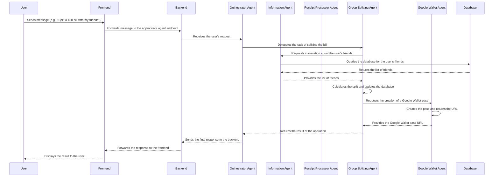

# Raseed

Raseed is a sophisticated, multi-agent financial management system designed to simplify personal and group expense tracking through a natural language conversational interface. It leverages the power of large language models (LLMs) to understand user queries, process receipts, manage budgets, and facilitate group payments. The system is architected for scalability and extensibility, with a clear separation of concerns between its backend services and the intelligent agent system.

## Key Features

- **Live Conversational AI**: A real-time, user-friendly chat interface allows users to manage their finances using natural language commands.
- **Automated Receipt Processing**: Users can upload receipt images, and the system will automatically extract key information, such as items, prices, and vendors.
- **Intelligent Expense Tracking**: The system categorizes expenses, tracks spending habits, and provides insightful financial analysis.
- **Seamless Group Expense Management**: Raseed simplifies splitting bills, tracking debts, and settling payments within groups.
- **Deep Google Wallet Integration**: The system can generate and manage Google Wallet passes for receipts and group expenses, providing a convenient way for users to keep track of their finances.
- **Natural Language Database Querying**: Users can ask complex questions about their financial data in plain English, and the system will translate them into SQL queries to retrieve the information.

## Design and Architecture

Raseed's architecture is divided into two main components: the **Backend** and the **Agents** system. This separation allows for a robust and scalable design, where the backend provides the foundational services and data storage, while the agents handle the intelligent processing and user interaction.

### Backend

The backend is built using a modern Python web framework and provides the following services:

- **RESTful API**: A comprehensive API for managing users, groups, expenses, and other financial data.
- **Database**: A robust database to store all application data, including user information, financial records, and group details.
- **Authentication and Authorization**: Secure user authentication and authorization using OAuth 2.0 with Google Sign-In.
- **Session Management**: A session management system to maintain user sessions and application state.

### Agents

The agent system is the core of Raseed's intelligence. It is composed of a hierarchy of specialized agents, each designed to perform a specific task. This multi-agent approach allows for a modular and extensible design, where new capabilities can be added by simply creating new agents.

- **Orchestrator Agent**: The top-level agent that receives user queries and delegates them to the appropriate specialized agent.
- **Live Agent**: A specialized agent that handles real-time, conversational interactions with users, providing a more dynamic and engaging user experience.
- **Information Agent**: Responsible for retrieving information from the database by converting natural language queries into SQL.
- **Analysis Agent**: Performs financial analysis and provides insights into user spending habits.
- **Receipt Processor Agent**: Extracts information from receipt images and creates structured expense data.
- **Group Splitting Agent**: Handles all aspects of group expense management, including bill splitting, debt tracking, and settlement.
- **Google Wallet Agent**: Manages the creation and updating of Google Wallet passes.

## Flow of Information

The following diagram illustrates the flow of information within the Raseed system:



## Getting Started

To get started with Raseed, you will need to have Docker and Docker Compose installed on your machine.

1. **Clone the repository:**

```bash
git clone https://github.com/your-username/raseed.git
```

2. **Set up the environment variables:**

Create a `.env` file in the root of the project and add the necessary environment variables, such as your Google API key and database credentials.

3. **Start the services:**

```bash
docker-compose up -d
```

This will start all the necessary services, including the backend server, the database, and the agent system.

4. **Access the application:**

Once the services are running, you can access the application by opening your web browser and navigating to `http://localhost:8080`.

## Contributing

We welcome contributions from the community. If you would like to contribute to the project, please follow these steps:

1. Fork the repository.
2. Create a new branch for your feature or bug fix.
3. Make your changes and commit them to your branch.
4. Push your changes to your fork.
5. Submit a pull request to the main repository.

Please make sure to follow the existing code style and conventions.

We hope you find Raseed useful. If you have any questions or feedback, please feel free to open an issue on GitHub.
